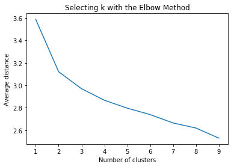
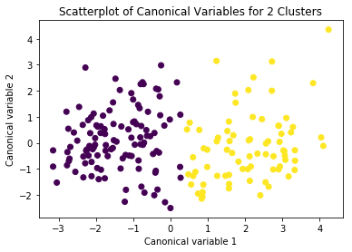

Assignment 4- Machine Learning for Data Analysis
======

Description of Dataset
----

## Source ##
For this assignment the Statlog (Heart) Data Set ([Link](https://archive.ics.uci.edu/ml/datasets/Statlog+%28Heart%29)) obtained from [UCI Machine Learning Repository](https://archive.ics.uci.edu/ml/datasets.html) is used. 


## Description
### Attribute Information:
 1. age
 2. sex
 3. chest pain type  (4 values)
 4. resting blood pressure
 5. serum cholestoral in mg/dl
 6. fasting blood sugar > 120 mg/dl
 7. resting electrocardiographic results  (values 0,1,2)
 8. maximum heart rate achieved
 9. exercise induced angina
 10. oldpeak = ST depression induced by exercise relative to rest
 11. the slope of the peak exercise ST segment
 12. number of major vessels (0-3) colored by flourosopy
 13. thal: 3 = normal; 6 = fixed defect; 7 = reversable defect
 
### Variable to be predicted
Absence (1) or presence (2) of heart disease

# Code


```python
#Importing Pandas
from pandas import Series, DataFrame
import pandas as pd

#Importing NumPy
import numpy as np

# Matplotlib to plot
import matplotlib.pylab as plt

#Importing sklearn 
from sklearn.cross_validation import train_test_split
from sklearn import preprocessing
from sklearn.cluster import KMeans

%matplotlib inline
```

Reading the dataset as raw_data as assigning names of attributes to each coloumn. Also visualising at top five rows of the data. 


```python
raw_data = pd.read_csv("heart.dat", delimiter=' ', names = ["age", "sex", "chestPainType", "RestBP", "SerumCholesterol", "FastingBP", "RestingECG", "MaxHR", "ExerciseInduceAgina", "Oldepeak", "SlopSTSegment", "NoVessels", "Thal", "Result"])

raw_data.head()
```


<div>
<table border="1" class="dataframe">
  <thead>
    <tr style="text-align: right;">
      <th></th>
      <th>age</th>
      <th>sex</th>
      <th>chestPainType</th>
      <th>RestBP</th>
      <th>SerumCholesterol</th>
      <th>FastingBP</th>
      <th>RestingECG</th>
      <th>MaxHR</th>
      <th>ExerciseInduceAgina</th>
      <th>Oldepeak</th>
      <th>SlopSTSegment</th>
      <th>NoVessels</th>
      <th>Thal</th>
      <th>Result</th>
    </tr>
  </thead>
  <tbody>
    <tr>
      <th>0</th>
      <td>70.0</td>
      <td>1.0</td>
      <td>4.0</td>
      <td>130.0</td>
      <td>322.0</td>
      <td>0.0</td>
      <td>2.0</td>
      <td>109.0</td>
      <td>0.0</td>
      <td>2.4</td>
      <td>2.0</td>
      <td>3.0</td>
      <td>3.0</td>
      <td>2</td>
    </tr>
    <tr>
      <th>1</th>
      <td>67.0</td>
      <td>0.0</td>
      <td>3.0</td>
      <td>115.0</td>
      <td>564.0</td>
      <td>0.0</td>
      <td>2.0</td>
      <td>160.0</td>
      <td>0.0</td>
      <td>1.6</td>
      <td>2.0</td>
      <td>0.0</td>
      <td>7.0</td>
      <td>1</td>
    </tr>
    <tr>
      <th>2</th>
      <td>57.0</td>
      <td>1.0</td>
      <td>2.0</td>
      <td>124.0</td>
      <td>261.0</td>
      <td>0.0</td>
      <td>0.0</td>
      <td>141.0</td>
      <td>0.0</td>
      <td>0.3</td>
      <td>1.0</td>
      <td>0.0</td>
      <td>7.0</td>
      <td>2</td>
    </tr>
    <tr>
      <th>3</th>
      <td>64.0</td>
      <td>1.0</td>
      <td>4.0</td>
      <td>128.0</td>
      <td>263.0</td>
      <td>0.0</td>
      <td>0.0</td>
      <td>105.0</td>
      <td>1.0</td>
      <td>0.2</td>
      <td>2.0</td>
      <td>1.0</td>
      <td>7.0</td>
      <td>1</td>
    </tr>
    <tr>
      <th>4</th>
      <td>74.0</td>
      <td>0.0</td>
      <td>2.0</td>
      <td>120.0</td>
      <td>269.0</td>
      <td>0.0</td>
      <td>2.0</td>
      <td>121.0</td>
      <td>1.0</td>
      <td>0.2</td>
      <td>1.0</td>
      <td>1.0</td>
      <td>3.0</td>
      <td>1</td>
    </tr>
  </tbody>
</table>
</div>


```python
raw_data.describe().transpose()
```


<div>
<table border="1" class="dataframe">
  <thead>
    <tr style="text-align: right;">
      <th></th>
      <th>count</th>
      <th>mean</th>
      <th>std</th>
      <th>min</th>
      <th>25%</th>
      <th>50%</th>
      <th>75%</th>
      <th>max</th>
    </tr>
  </thead>
  <tbody>
    <tr>
      <th>age</th>
      <td>270.0</td>
      <td>54.433333</td>
      <td>9.109067</td>
      <td>29.0</td>
      <td>48.0</td>
      <td>55.0</td>
      <td>61.0</td>
      <td>77.0</td>
    </tr>
    <tr>
      <th>sex</th>
      <td>270.0</td>
      <td>0.677778</td>
      <td>0.468195</td>
      <td>0.0</td>
      <td>0.0</td>
      <td>1.0</td>
      <td>1.0</td>
      <td>1.0</td>
    </tr>
    <tr>
      <th>chestPainType</th>
      <td>270.0</td>
      <td>3.174074</td>
      <td>0.950090</td>
      <td>1.0</td>
      <td>3.0</td>
      <td>3.0</td>
      <td>4.0</td>
      <td>4.0</td>
    </tr>
    <tr>
      <th>RestBP</th>
      <td>270.0</td>
      <td>131.344444</td>
      <td>17.861608</td>
      <td>94.0</td>
      <td>120.0</td>
      <td>130.0</td>
      <td>140.0</td>
      <td>200.0</td>
    </tr>
    <tr>
      <th>SerumCholesterol</th>
      <td>270.0</td>
      <td>249.659259</td>
      <td>51.686237</td>
      <td>126.0</td>
      <td>213.0</td>
      <td>245.0</td>
      <td>280.0</td>
      <td>564.0</td>
    </tr>
    <tr>
      <th>FastingBP</th>
      <td>270.0</td>
      <td>0.148148</td>
      <td>0.355906</td>
      <td>0.0</td>
      <td>0.0</td>
      <td>0.0</td>
      <td>0.0</td>
      <td>1.0</td>
    </tr>
    <tr>
      <th>RestingECG</th>
      <td>270.0</td>
      <td>1.022222</td>
      <td>0.997891</td>
      <td>0.0</td>
      <td>0.0</td>
      <td>2.0</td>
      <td>2.0</td>
      <td>2.0</td>
    </tr>
    <tr>
      <th>MaxHR</th>
      <td>270.0</td>
      <td>149.677778</td>
      <td>23.165717</td>
      <td>71.0</td>
      <td>133.0</td>
      <td>153.5</td>
      <td>166.0</td>
      <td>202.0</td>
    </tr>
    <tr>
      <th>ExerciseInduceAgina</th>
      <td>270.0</td>
      <td>0.329630</td>
      <td>0.470952</td>
      <td>0.0</td>
      <td>0.0</td>
      <td>0.0</td>
      <td>1.0</td>
      <td>1.0</td>
    </tr>
    <tr>
      <th>Oldepeak</th>
      <td>270.0</td>
      <td>1.050000</td>
      <td>1.145210</td>
      <td>0.0</td>
      <td>0.0</td>
      <td>0.8</td>
      <td>1.6</td>
      <td>6.2</td>
    </tr>
    <tr>
      <th>SlopSTSegment</th>
      <td>270.0</td>
      <td>1.585185</td>
      <td>0.614390</td>
      <td>1.0</td>
      <td>1.0</td>
      <td>2.0</td>
      <td>2.0</td>
      <td>3.0</td>
    </tr>
    <tr>
      <th>NoVessels</th>
      <td>270.0</td>
      <td>0.670370</td>
      <td>0.943896</td>
      <td>0.0</td>
      <td>0.0</td>
      <td>0.0</td>
      <td>1.0</td>
      <td>3.0</td>
    </tr>
    <tr>
      <th>Thal</th>
      <td>270.0</td>
      <td>4.696296</td>
      <td>1.940659</td>
      <td>3.0</td>
      <td>3.0</td>
      <td>3.0</td>
      <td>7.0</td>
      <td>7.0</td>
    </tr>
    <tr>
      <th>Result</th>
      <td>270.0</td>
      <td>1.444444</td>
      <td>0.497827</td>
      <td>1.0</td>
      <td>1.0</td>
      <td>1.0</td>
      <td>2.0</td>
      <td>2.0</td>
    </tr>
  </tbody>
</table>
</div>


Creating dataframe without the target (col name = results)


```python
predictors = raw_data.drop(["age"], axis=1)
#Shape of the data.
predictors.shape
```


    (270, 13)


Storing target values in new array


```python
from sklearn import preprocessing
```


```python
predictors.shape
ListOfFeatures = list(predictors)
predictors_new = pd.DataFrame(preprocessing.scale(predictors, with_mean=True, with_std=True))
predictors_new.columns = ListOfFeatures
predictors_new.head()
```


<div>
<table border="1" class="dataframe">
  <thead>
    <tr style="text-align: right;">
      <th></th>
      <th>sex</th>
      <th>chestPainType</th>
      <th>RestBP</th>
      <th>SerumCholesterol</th>
      <th>FastingBP</th>
      <th>RestingECG</th>
      <th>MaxHR</th>
      <th>ExerciseInduceAgina</th>
      <th>Oldepeak</th>
      <th>SlopSTSegment</th>
      <th>NoVessels</th>
      <th>Thal</th>
      <th>Result</th>
    </tr>
  </thead>
  <tbody>
    <tr>
      <th>0</th>
      <td>0.689500</td>
      <td>0.870928</td>
      <td>-0.075410</td>
      <td>1.402212</td>
      <td>-0.417029</td>
      <td>0.981664</td>
      <td>-1.759208</td>
      <td>-0.701222</td>
      <td>1.181012</td>
      <td>0.676419</td>
      <td>2.472682</td>
      <td>-0.875706</td>
      <td>1.118034</td>
    </tr>
    <tr>
      <th>1</th>
      <td>-1.450327</td>
      <td>-0.183559</td>
      <td>-0.916759</td>
      <td>6.093004</td>
      <td>-0.417029</td>
      <td>0.981664</td>
      <td>0.446409</td>
      <td>-0.701222</td>
      <td>0.481153</td>
      <td>0.676419</td>
      <td>-0.711535</td>
      <td>1.189277</td>
      <td>-0.894427</td>
    </tr>
    <tr>
      <th>2</th>
      <td>0.689500</td>
      <td>-1.238045</td>
      <td>-0.411950</td>
      <td>0.219823</td>
      <td>-0.417029</td>
      <td>-1.026285</td>
      <td>-0.375291</td>
      <td>-0.701222</td>
      <td>-0.656118</td>
      <td>-0.954234</td>
      <td>-0.711535</td>
      <td>1.189277</td>
      <td>1.118034</td>
    </tr>
    <tr>
      <th>3</th>
      <td>0.689500</td>
      <td>0.870928</td>
      <td>-0.187590</td>
      <td>0.258589</td>
      <td>-0.417029</td>
      <td>-1.026285</td>
      <td>-1.932198</td>
      <td>1.426081</td>
      <td>-0.743600</td>
      <td>0.676419</td>
      <td>0.349871</td>
      <td>1.189277</td>
      <td>-0.894427</td>
    </tr>
    <tr>
      <th>4</th>
      <td>-1.450327</td>
      <td>-1.238045</td>
      <td>-0.636310</td>
      <td>0.374890</td>
      <td>-0.417029</td>
      <td>0.981664</td>
      <td>-1.240239</td>
      <td>1.426081</td>
      <td>-0.743600</td>
      <td>-0.954234</td>
      <td>0.349871</td>
      <td>-0.875706</td>
      <td>-0.894427</td>
    </tr>
  </tbody>
</table>
</div>


Splitting data into training and test set 60:40. 


```python
clus_train, clus_test = train_test_split(predictors_new, test_size=.3, random_state=123)
```


```python
# k-means cluster analysis for 1-9 clusters                                                           
from scipy.spatial.distance import cdist
clusters=range(1,10)
meandist=[]
```


```python
for k in clusters:
    model=KMeans(n_clusters=k)
    model.fit(clus_train)
    clusassign=model.predict(clus_train)
    meandist.append(sum(np.min(cdist(clus_train, model.cluster_centers_, 'euclidean'), axis=1)) 
    / clus_train.shape[0])
```


```python
"""
Plot average distance from observations from the cluster centroid
to use the Elbow Method to identify number of clusters to choose
"""

plt.plot(clusters, meandist)
plt.xlabel('Number of clusters')
plt.ylabel('Average distance')
plt.title('Selecting k with the Elbow Method')
```


    <matplotlib.text.Text at 0x2db5d51fe80>





```python
# Interpret 3 cluster solution
model3=KMeans(n_clusters=2)
model3.fit(clus_train)
clusassign=model3.predict(clus_train)
# plot clusters
```


```python
from sklearn.decomposition import PCA
pca_2 = PCA(2)
plot_columns = pca_2.fit_transform(clus_train)
plt.scatter(x=plot_columns[:,0], y=plot_columns[:,1], c=model3.labels_,)
plt.xlabel('Canonical variable 1')
plt.ylabel('Canonical variable 2')
plt.title('Scatterplot of Canonical Variables for 2 Clusters')
plt.show()
```





```python
clus_train.reset_index(level=0, inplace=True)
```


```python
cluslist=list(clus_train['index'])
```


```python
labels=list(model3.labels_)
```


```python
# combine index variable list with cluster assignment list into a dictionary
newlist=dict(zip(cluslist, labels))
newlist
```


    {0: 1,
     1: 0,
     2: 0,
     3: 1,
     6: 1,
     7: 1,
     8: 1,
     9: 1,
     12: 0,
     13: 1,
     14: 0,
     15: 0,
     16: 1,
     17: 1,
     18: 0,
     22: 0,
     25: 0,
     27: 0,
     32: 0,
     34: 1,
     35: 1,
     36: 1,
     38: 0,
     39: 0,
     40: 0,
     41: 0,
     43: 0,
     44: 1,
     45: 0,
     46: 1,
     47: 0,
     48: 1,
     49: 1,
     50: 1,
     51: 0,
     54: 0,
     55: 0,
     56: 1,
     57: 0,
     58: 1,
     59: 1,
     60: 0,
     63: 0,
     64: 0,
     65: 1,
     66: 0,
     67: 0,
     68: 0,
     69: 0,
     70: 1,
     73: 0,
     74: 0,
     75: 1,
     76: 1,
     77: 0,
     78: 0,
     83: 0,
     84: 1,
     86: 0,
     87: 1,
     88: 0,
     92: 1,
     93: 1,
     94: 1,
     96: 0,
     97: 0,
     98: 0,
     99: 0,
     101: 1,
     102: 0,
     103: 1,
     104: 1,
     105: 1,
     106: 0,
     107: 1,
     108: 1,
     109: 0,
     110: 1,
     111: 0,
     112: 0,
     113: 0,
     114: 0,
     115: 0,
     116: 1,
     117: 1,
     118: 0,
     119: 1,
     121: 1,
     122: 1,
     123: 0,
     124: 0,
     126: 1,
     129: 1,
     131: 1,
     133: 1,
     134: 0,
     135: 0,
     136: 0,
     138: 0,
     139: 0,
     140: 1,
     141: 0,
     143: 0,
     144: 0,
     145: 1,
     146: 0,
     147: 1,
     149: 0,
     151: 0,
     153: 0,
     154: 0,
     155: 0,
     156: 1,
     157: 0,
     158: 0,
     162: 0,
     163: 1,
     164: 0,
     165: 0,
     167: 0,
     168: 0,
     169: 0,
     170: 0,
     172: 1,
     173: 0,
     174: 0,
     175: 1,
     176: 1,
     177: 1,
     178: 1,
     179: 0,
     180: 0,
     182: 0,
     183: 0,
     184: 0,
     185: 0,
     186: 1,
     188: 0,
     189: 1,
     190: 0,
     191: 1,
     195: 0,
     197: 0,
     198: 0,
     202: 1,
     203: 1,
     205: 0,
     206: 0,
     207: 0,
     208: 1,
     211: 0,
     212: 0,
     213: 1,
     214: 0,
     216: 0,
     218: 0,
     219: 0,
     220: 1,
     222: 0,
     223: 1,
     224: 0,
     225: 0,
     226: 1,
     228: 0,
     229: 0,
     230: 1,
     231: 1,
     233: 1,
     234: 1,
     235: 1,
     236: 0,
     237: 1,
     240: 1,
     241: 0,
     242: 0,
     244: 0,
     245: 1,
     247: 0,
     249: 1,
     254: 0,
     257: 1,
     258: 0,
     260: 0,
     263: 0,
     264: 0,
     265: 0,
     266: 0,
     267: 0,
     269: 1}


```python
# convert newlist dictionary to a dataframe
newclus=DataFrame.from_dict(newlist, orient='index')
```


```python
# rename the cluster assignment column
newclus.columns = ['cluster']
```


```python
# now do the same for the cluster assignment variable
# create a unique identifier variable from the index for the 
# cluster assignment dataframe 
# to merge with cluster training data
newclus.reset_index(level=0, inplace=True)
```


```python
# merge the cluster assignment dataframe with the cluster training variable dataframe
# by the index variable
merged_train=pd.merge(clus_train, newclus, on='index')
merged_train.head(n=100)
```


<div>
<table border="1" class="dataframe">
  <thead>
    <tr style="text-align: right;">
      <th></th>
      <th>index</th>
      <th>sex</th>
      <th>chestPainType</th>
      <th>RestBP</th>
      <th>SerumCholesterol</th>
      <th>FastingBP</th>
      <th>RestingECG</th>
      <th>MaxHR</th>
      <th>ExerciseInduceAgina</th>
      <th>Oldepeak</th>
      <th>SlopSTSegment</th>
      <th>NoVessels</th>
      <th>Thal</th>
      <th>Result</th>
      <th>cluster</th>
    </tr>
  </thead>
  <tbody>
    <tr>
      <th>0</th>
      <td>54</td>
      <td>-1.450327</td>
      <td>-1.238045</td>
      <td>-0.075410</td>
      <td>-0.303530</td>
      <td>-0.417029</td>
      <td>0.981664</td>
      <td>1.095120</td>
      <td>-0.701222</td>
      <td>-0.393671</td>
      <td>0.676419</td>
      <td>-0.711535</td>
      <td>-0.875706</td>
      <td>-0.894427</td>
      <td>0</td>
    </tr>
    <tr>
      <th>1</th>
      <td>229</td>
      <td>0.689500</td>
      <td>-2.292532</td>
      <td>-0.748489</td>
      <td>-1.233935</td>
      <td>-0.417029</td>
      <td>0.981664</td>
      <td>1.743831</td>
      <td>-0.701222</td>
      <td>-0.918565</td>
      <td>0.676419</td>
      <td>-0.711535</td>
      <td>0.673032</td>
      <td>-0.894427</td>
      <td>0</td>
    </tr>
    <tr>
      <th>2</th>
      <td>211</td>
      <td>0.689500</td>
      <td>-0.183559</td>
      <td>-0.355860</td>
      <td>-0.090312</td>
      <td>2.397916</td>
      <td>0.981664</td>
      <td>0.705894</td>
      <td>-0.701222</td>
      <td>1.181012</td>
      <td>0.676419</td>
      <td>-0.711535</td>
      <td>-0.875706</td>
      <td>-0.894427</td>
      <td>0</td>
    </tr>
    <tr>
      <th>3</th>
      <td>35</td>
      <td>0.689500</td>
      <td>0.870928</td>
      <td>-0.075410</td>
      <td>0.122905</td>
      <td>2.397916</td>
      <td>0.981664</td>
      <td>0.013935</td>
      <td>1.426081</td>
      <td>-0.918565</td>
      <td>-0.954234</td>
      <td>1.411276</td>
      <td>1.189277</td>
      <td>1.118034</td>
      <td>1</td>
    </tr>
    <tr>
      <th>4</th>
      <td>263</td>
      <td>0.689500</td>
      <td>-1.238045</td>
      <td>-0.075410</td>
      <td>0.316740</td>
      <td>-0.417029</td>
      <td>-1.026285</td>
      <td>0.922131</td>
      <td>-0.701222</td>
      <td>-0.393671</td>
      <td>-0.954234</td>
      <td>-0.711535</td>
      <td>-0.875706</td>
      <td>-0.894427</td>
      <td>0</td>
    </tr>
    <tr>
      <th>5</th>
      <td>143</td>
      <td>0.689500</td>
      <td>-2.292532</td>
      <td>-0.355860</td>
      <td>-0.710583</td>
      <td>-0.417029</td>
      <td>0.981664</td>
      <td>-1.067250</td>
      <td>1.426081</td>
      <td>0.306188</td>
      <td>-0.954234</td>
      <td>0.349871</td>
      <td>-0.875706</td>
      <td>-0.894427</td>
      <td>0</td>
    </tr>
    <tr>
      <th>6</th>
      <td>147</td>
      <td>0.689500</td>
      <td>0.870928</td>
      <td>-1.197209</td>
      <td>-1.602221</td>
      <td>-0.417029</td>
      <td>0.981664</td>
      <td>-1.542971</td>
      <td>1.426081</td>
      <td>0.831083</td>
      <td>0.676419</td>
      <td>-0.711535</td>
      <td>1.189277</td>
      <td>1.118034</td>
      <td>1</td>
    </tr>
    <tr>
      <th>7</th>
      <td>185</td>
      <td>0.689500</td>
      <td>-0.183559</td>
      <td>-0.075410</td>
      <td>1.266528</td>
      <td>-0.417029</td>
      <td>-1.026285</td>
      <td>0.532904</td>
      <td>-0.701222</td>
      <td>0.743600</td>
      <td>-0.954234</td>
      <td>0.349871</td>
      <td>-0.875706</td>
      <td>-0.894427</td>
      <td>0</td>
    </tr>
    <tr>
      <th>8</th>
      <td>241</td>
      <td>0.689500</td>
      <td>-0.183559</td>
      <td>0.485490</td>
      <td>1.382829</td>
      <td>-0.417029</td>
      <td>0.981664</td>
      <td>1.397852</td>
      <td>-0.701222</td>
      <td>-0.918565</td>
      <td>-0.954234</td>
      <td>-0.711535</td>
      <td>-0.875706</td>
      <td>-0.894427</td>
      <td>0</td>
    </tr>
    <tr>
      <th>9</th>
      <td>50</td>
      <td>0.689500</td>
      <td>0.870928</td>
      <td>0.261130</td>
      <td>1.266528</td>
      <td>-0.417029</td>
      <td>-1.026285</td>
      <td>-1.067250</td>
      <td>1.426081</td>
      <td>0.656118</td>
      <td>0.676419</td>
      <td>-0.711535</td>
      <td>0.673032</td>
      <td>1.118034</td>
      <td>1</td>
    </tr>
    <tr>
      <th>10</th>
      <td>216</td>
      <td>-1.450327</td>
      <td>-0.183559</td>
      <td>0.205040</td>
      <td>0.045372</td>
      <td>-0.417029</td>
      <td>0.981664</td>
      <td>0.965378</td>
      <td>-0.701222</td>
      <td>-0.918565</td>
      <td>-0.954234</td>
      <td>-0.711535</td>
      <td>-0.875706</td>
      <td>-0.894427</td>
      <td>0</td>
    </tr>
    <tr>
      <th>11</th>
      <td>226</td>
      <td>-1.450327</td>
      <td>-0.183559</td>
      <td>-0.075410</td>
      <td>0.258589</td>
      <td>-0.417029</td>
      <td>-1.026285</td>
      <td>-2.278177</td>
      <td>-0.701222</td>
      <td>0.131224</td>
      <td>0.676419</td>
      <td>0.349871</td>
      <td>1.189277</td>
      <td>1.118034</td>
      <td>1</td>
    </tr>
    <tr>
      <th>12</th>
      <td>264</td>
      <td>0.689500</td>
      <td>-1.238045</td>
      <td>-1.197209</td>
      <td>-0.400447</td>
      <td>-0.417029</td>
      <td>-1.026285</td>
      <td>0.792388</td>
      <td>-0.701222</td>
      <td>-0.043741</td>
      <td>2.307073</td>
      <td>-0.711535</td>
      <td>1.189277</td>
      <td>1.118034</td>
      <td>0</td>
    </tr>
    <tr>
      <th>13</th>
      <td>267</td>
      <td>-1.450327</td>
      <td>-1.238045</td>
      <td>0.485490</td>
      <td>0.859476</td>
      <td>-0.417029</td>
      <td>0.981664</td>
      <td>0.143677</td>
      <td>-0.701222</td>
      <td>0.218706</td>
      <td>0.676419</td>
      <td>-0.711535</td>
      <td>-0.875706</td>
      <td>-0.894427</td>
      <td>0</td>
    </tr>
    <tr>
      <th>14</th>
      <td>219</td>
      <td>0.689500</td>
      <td>-1.238045</td>
      <td>-0.636310</td>
      <td>-0.574898</td>
      <td>-0.417029</td>
      <td>-1.026285</td>
      <td>0.878883</td>
      <td>-0.701222</td>
      <td>-0.918565</td>
      <td>-0.954234</td>
      <td>-0.711535</td>
      <td>-0.875706</td>
      <td>-0.894427</td>
      <td>0</td>
    </tr>
    <tr>
      <th>15</th>
      <td>258</td>
      <td>0.689500</td>
      <td>-0.183559</td>
      <td>0.485490</td>
      <td>1.654197</td>
      <td>-0.417029</td>
      <td>-1.026285</td>
      <td>0.359914</td>
      <td>-0.701222</td>
      <td>-0.918565</td>
      <td>-0.954234</td>
      <td>-0.711535</td>
      <td>-0.875706</td>
      <td>1.118034</td>
      <td>0</td>
    </tr>
    <tr>
      <th>16</th>
      <td>165</td>
      <td>-1.450327</td>
      <td>0.870928</td>
      <td>2.729088</td>
      <td>1.460363</td>
      <td>-0.417029</td>
      <td>-1.026285</td>
      <td>0.186925</td>
      <td>1.426081</td>
      <td>-0.918565</td>
      <td>-0.954234</td>
      <td>-0.711535</td>
      <td>-0.875706</td>
      <td>-0.894427</td>
      <td>0</td>
    </tr>
    <tr>
      <th>17</th>
      <td>179</td>
      <td>0.689500</td>
      <td>-0.183559</td>
      <td>-0.131500</td>
      <td>-1.040101</td>
      <td>-0.417029</td>
      <td>-1.026285</td>
      <td>0.576151</td>
      <td>-0.701222</td>
      <td>-0.918565</td>
      <td>-0.954234</td>
      <td>-0.711535</td>
      <td>-0.875706</td>
      <td>-0.894427</td>
      <td>0</td>
    </tr>
    <tr>
      <th>18</th>
      <td>114</td>
      <td>0.689500</td>
      <td>-1.238045</td>
      <td>-0.636310</td>
      <td>0.878859</td>
      <td>-0.417029</td>
      <td>-1.026285</td>
      <td>0.532904</td>
      <td>-0.701222</td>
      <td>-0.918565</td>
      <td>-0.954234</td>
      <td>-0.711535</td>
      <td>-0.875706</td>
      <td>-0.894427</td>
      <td>0</td>
    </tr>
    <tr>
      <th>19</th>
      <td>41</td>
      <td>-1.450327</td>
      <td>0.870928</td>
      <td>-0.411950</td>
      <td>-0.788116</td>
      <td>-0.417029</td>
      <td>-1.026285</td>
      <td>0.576151</td>
      <td>-0.701222</td>
      <td>-0.918565</td>
      <td>-0.954234</td>
      <td>-0.711535</td>
      <td>-0.875706</td>
      <td>-0.894427</td>
      <td>0</td>
    </tr>
    <tr>
      <th>20</th>
      <td>184</td>
      <td>0.689500</td>
      <td>-0.183559</td>
      <td>-0.075410</td>
      <td>-0.070929</td>
      <td>2.397916</td>
      <td>0.981664</td>
      <td>1.008625</td>
      <td>-0.701222</td>
      <td>-0.918565</td>
      <td>-0.954234</td>
      <td>2.472682</td>
      <td>-0.875706</td>
      <td>-0.894427</td>
      <td>0</td>
    </tr>
    <tr>
      <th>21</th>
      <td>151</td>
      <td>-1.450327</td>
      <td>-0.183559</td>
      <td>-0.636310</td>
      <td>-0.594282</td>
      <td>-0.417029</td>
      <td>-1.026285</td>
      <td>0.359914</td>
      <td>-0.701222</td>
      <td>0.481153</td>
      <td>0.676419</td>
      <td>-0.711535</td>
      <td>-0.875706</td>
      <td>-0.894427</td>
      <td>0</td>
    </tr>
    <tr>
      <th>22</th>
      <td>13</td>
      <td>0.689500</td>
      <td>-2.292532</td>
      <td>0.148950</td>
      <td>-0.303530</td>
      <td>-0.417029</td>
      <td>-1.026285</td>
      <td>-0.202302</td>
      <td>-0.701222</td>
      <td>1.355977</td>
      <td>0.676419</td>
      <td>1.411276</td>
      <td>-0.875706</td>
      <td>1.118034</td>
      <td>1</td>
    </tr>
    <tr>
      <th>23</th>
      <td>7</td>
      <td>0.689500</td>
      <td>0.870928</td>
      <td>-1.197209</td>
      <td>-0.206613</td>
      <td>-0.417029</td>
      <td>0.981664</td>
      <td>-0.332044</td>
      <td>1.426081</td>
      <td>0.131224</td>
      <td>0.676419</td>
      <td>0.349871</td>
      <td>1.189277</td>
      <td>1.118034</td>
      <td>1</td>
    </tr>
    <tr>
      <th>24</th>
      <td>190</td>
      <td>0.689500</td>
      <td>0.870928</td>
      <td>0.485490</td>
      <td>-0.206613</td>
      <td>-0.417029</td>
      <td>-1.026285</td>
      <td>0.446409</td>
      <td>-0.701222</td>
      <td>0.131224</td>
      <td>-0.954234</td>
      <td>-0.711535</td>
      <td>-0.875706</td>
      <td>-0.894427</td>
      <td>0</td>
    </tr>
    <tr>
      <th>25</th>
      <td>107</td>
      <td>-1.450327</td>
      <td>0.870928</td>
      <td>1.046389</td>
      <td>0.161672</td>
      <td>-0.417029</td>
      <td>0.981664</td>
      <td>0.316667</td>
      <td>-0.701222</td>
      <td>1.355977</td>
      <td>0.676419</td>
      <td>1.411276</td>
      <td>1.189277</td>
      <td>1.118034</td>
      <td>1</td>
    </tr>
    <tr>
      <th>26</th>
      <td>220</td>
      <td>0.689500</td>
      <td>0.870928</td>
      <td>-1.197209</td>
      <td>-0.206613</td>
      <td>-0.417029</td>
      <td>-1.026285</td>
      <td>-1.024002</td>
      <td>1.426081</td>
      <td>1.530942</td>
      <td>0.676419</td>
      <td>0.349871</td>
      <td>1.189277</td>
      <td>1.118034</td>
      <td>1</td>
    </tr>
    <tr>
      <th>27</th>
      <td>157</td>
      <td>0.689500</td>
      <td>-1.238045</td>
      <td>-0.187590</td>
      <td>1.130844</td>
      <td>-0.417029</td>
      <td>0.981664</td>
      <td>0.878883</td>
      <td>-0.701222</td>
      <td>-0.918565</td>
      <td>-0.954234</td>
      <td>-0.711535</td>
      <td>-0.875706</td>
      <td>-0.894427</td>
      <td>0</td>
    </tr>
    <tr>
      <th>28</th>
      <td>122</td>
      <td>0.689500</td>
      <td>0.870928</td>
      <td>1.158569</td>
      <td>0.471807</td>
      <td>-0.417029</td>
      <td>-1.026285</td>
      <td>-2.667404</td>
      <td>1.426081</td>
      <td>0.131224</td>
      <td>0.676419</td>
      <td>0.349871</td>
      <td>1.189277</td>
      <td>1.118034</td>
      <td>1</td>
    </tr>
    <tr>
      <th>29</th>
      <td>203</td>
      <td>0.689500</td>
      <td>0.870928</td>
      <td>0.485490</td>
      <td>0.956393</td>
      <td>-0.417029</td>
      <td>-1.026285</td>
      <td>1.008625</td>
      <td>1.426081</td>
      <td>0.481153</td>
      <td>-0.954234</td>
      <td>-0.711535</td>
      <td>1.189277</td>
      <td>1.118034</td>
      <td>1</td>
    </tr>
    <tr>
      <th>...</th>
      <td>...</td>
      <td>...</td>
      <td>...</td>
      <td>...</td>
      <td>...</td>
      <td>...</td>
      <td>...</td>
      <td>...</td>
      <td>...</td>
      <td>...</td>
      <td>...</td>
      <td>...</td>
      <td>...</td>
      <td>...</td>
      <td>...</td>
    </tr>
    <tr>
      <th>70</th>
      <td>133</td>
      <td>0.689500</td>
      <td>0.870928</td>
      <td>-0.636310</td>
      <td>-0.070929</td>
      <td>-0.417029</td>
      <td>0.981664</td>
      <td>-2.321424</td>
      <td>1.426081</td>
      <td>1.006048</td>
      <td>2.307073</td>
      <td>0.349871</td>
      <td>-0.875706</td>
      <td>1.118034</td>
      <td>1</td>
    </tr>
    <tr>
      <th>71</th>
      <td>16</td>
      <td>0.689500</td>
      <td>0.870928</td>
      <td>0.485490</td>
      <td>1.188994</td>
      <td>-0.417029</td>
      <td>-1.026285</td>
      <td>-1.283487</td>
      <td>1.426081</td>
      <td>0.656118</td>
      <td>0.676419</td>
      <td>1.411276</td>
      <td>1.189277</td>
      <td>1.118034</td>
      <td>1</td>
    </tr>
    <tr>
      <th>72</th>
      <td>236</td>
      <td>-1.450327</td>
      <td>0.870928</td>
      <td>0.373310</td>
      <td>-0.303530</td>
      <td>-0.417029</td>
      <td>0.981664</td>
      <td>0.446409</td>
      <td>-0.701222</td>
      <td>-0.918565</td>
      <td>-0.954234</td>
      <td>-0.711535</td>
      <td>-0.875706</td>
      <td>-0.894427</td>
      <td>0</td>
    </tr>
    <tr>
      <th>73</th>
      <td>156</td>
      <td>0.689500</td>
      <td>0.870928</td>
      <td>0.485490</td>
      <td>-0.633049</td>
      <td>-0.417029</td>
      <td>-1.026285</td>
      <td>-1.672713</td>
      <td>1.426081</td>
      <td>3.980449</td>
      <td>2.307073</td>
      <td>-0.711535</td>
      <td>1.189277</td>
      <td>1.118034</td>
      <td>1</td>
    </tr>
    <tr>
      <th>74</th>
      <td>116</td>
      <td>0.689500</td>
      <td>0.870928</td>
      <td>-0.636310</td>
      <td>-0.012779</td>
      <td>-0.417029</td>
      <td>0.981664</td>
      <td>-0.245549</td>
      <td>-0.701222</td>
      <td>-0.218706</td>
      <td>-0.954234</td>
      <td>-0.711535</td>
      <td>1.189277</td>
      <td>1.118034</td>
      <td>1</td>
    </tr>
    <tr>
      <th>75</th>
      <td>231</td>
      <td>0.689500</td>
      <td>0.870928</td>
      <td>-0.748489</td>
      <td>-0.594282</td>
      <td>-0.417029</td>
      <td>-1.026285</td>
      <td>-0.418539</td>
      <td>-0.701222</td>
      <td>0.131224</td>
      <td>0.676419</td>
      <td>-0.711535</td>
      <td>1.189277</td>
      <td>1.118034</td>
      <td>1</td>
    </tr>
    <tr>
      <th>76</th>
      <td>74</td>
      <td>-1.450327</td>
      <td>0.870928</td>
      <td>-1.421569</td>
      <td>-0.516748</td>
      <td>-0.417029</td>
      <td>-1.026285</td>
      <td>-0.332044</td>
      <td>-0.701222</td>
      <td>-0.656118</td>
      <td>-0.954234</td>
      <td>1.411276</td>
      <td>-0.875706</td>
      <td>-0.894427</td>
      <td>0</td>
    </tr>
    <tr>
      <th>77</th>
      <td>110</td>
      <td>-1.450327</td>
      <td>0.870928</td>
      <td>2.729088</td>
      <td>1.499130</td>
      <td>-0.417029</td>
      <td>-0.022311</td>
      <td>-1.413229</td>
      <td>1.426081</td>
      <td>2.055836</td>
      <td>0.676419</td>
      <td>-0.711535</td>
      <td>-0.875706</td>
      <td>1.118034</td>
      <td>1</td>
    </tr>
    <tr>
      <th>78</th>
      <td>145</td>
      <td>0.689500</td>
      <td>0.870928</td>
      <td>-0.468040</td>
      <td>0.626875</td>
      <td>-0.417029</td>
      <td>-1.026285</td>
      <td>-2.364672</td>
      <td>1.426081</td>
      <td>0.831083</td>
      <td>0.676419</td>
      <td>1.411276</td>
      <td>1.189277</td>
      <td>1.118034</td>
      <td>1</td>
    </tr>
    <tr>
      <th>79</th>
      <td>38</td>
      <td>0.689500</td>
      <td>-0.183559</td>
      <td>-0.075410</td>
      <td>-1.350236</td>
      <td>-0.417029</td>
      <td>-1.026285</td>
      <td>0.013935</td>
      <td>-0.701222</td>
      <td>-0.918565</td>
      <td>-0.954234</td>
      <td>-0.711535</td>
      <td>-0.875706</td>
      <td>-0.894427</td>
      <td>0</td>
    </tr>
    <tr>
      <th>80</th>
      <td>27</td>
      <td>-1.450327</td>
      <td>-0.183559</td>
      <td>-0.636310</td>
      <td>0.878859</td>
      <td>-0.417029</td>
      <td>0.981664</td>
      <td>0.316667</td>
      <td>-0.701222</td>
      <td>-0.393671</td>
      <td>-0.954234</td>
      <td>-0.711535</td>
      <td>-0.875706</td>
      <td>-0.894427</td>
      <td>0</td>
    </tr>
    <tr>
      <th>81</th>
      <td>140</td>
      <td>0.689500</td>
      <td>0.870928</td>
      <td>0.765940</td>
      <td>-0.729966</td>
      <td>-0.417029</td>
      <td>0.981664</td>
      <td>-0.764518</td>
      <td>-0.701222</td>
      <td>0.831083</td>
      <td>0.676419</td>
      <td>1.411276</td>
      <td>0.673032</td>
      <td>1.118034</td>
      <td>1</td>
    </tr>
    <tr>
      <th>82</th>
      <td>121</td>
      <td>0.689500</td>
      <td>0.870928</td>
      <td>-0.524130</td>
      <td>0.704409</td>
      <td>-0.417029</td>
      <td>0.981664</td>
      <td>-1.456476</td>
      <td>1.426081</td>
      <td>1.880872</td>
      <td>0.676419</td>
      <td>1.411276</td>
      <td>-0.875706</td>
      <td>1.118034</td>
      <td>1</td>
    </tr>
    <tr>
      <th>83</th>
      <td>198</td>
      <td>-1.450327</td>
      <td>-2.292532</td>
      <td>0.485490</td>
      <td>-0.206613</td>
      <td>-0.417029</td>
      <td>-1.026285</td>
      <td>0.057183</td>
      <td>-0.701222</td>
      <td>0.656118</td>
      <td>-0.954234</td>
      <td>1.411276</td>
      <td>-0.875706</td>
      <td>-0.894427</td>
      <td>0</td>
    </tr>
    <tr>
      <th>84</th>
      <td>87</td>
      <td>0.689500</td>
      <td>-2.292532</td>
      <td>2.616909</td>
      <td>0.394274</td>
      <td>-0.417029</td>
      <td>0.981664</td>
      <td>-0.202302</td>
      <td>-0.701222</td>
      <td>2.755695</td>
      <td>2.307073</td>
      <td>-0.711535</td>
      <td>1.189277</td>
      <td>-0.894427</td>
      <td>1</td>
    </tr>
    <tr>
      <th>85</th>
      <td>9</td>
      <td>-1.450327</td>
      <td>0.870928</td>
      <td>1.046389</td>
      <td>3.049805</td>
      <td>-0.417029</td>
      <td>0.981664</td>
      <td>0.186925</td>
      <td>-0.701222</td>
      <td>2.580731</td>
      <td>0.676419</td>
      <td>2.472682</td>
      <td>1.189277</td>
      <td>1.118034</td>
      <td>1</td>
    </tr>
    <tr>
      <th>86</th>
      <td>6</td>
      <td>0.689500</td>
      <td>-0.183559</td>
      <td>-0.075410</td>
      <td>0.122905</td>
      <td>2.397916</td>
      <td>0.981664</td>
      <td>-0.332044</td>
      <td>1.426081</td>
      <td>-0.393671</td>
      <td>0.676419</td>
      <td>0.349871</td>
      <td>0.673032</td>
      <td>1.118034</td>
      <td>1</td>
    </tr>
    <tr>
      <th>87</th>
      <td>170</td>
      <td>0.689500</td>
      <td>-2.292532</td>
      <td>1.607289</td>
      <td>-0.303530</td>
      <td>2.397916</td>
      <td>0.981664</td>
      <td>-0.807765</td>
      <td>-0.701222</td>
      <td>-0.831083</td>
      <td>0.676419</td>
      <td>0.349871</td>
      <td>-0.875706</td>
      <td>-0.894427</td>
      <td>0</td>
    </tr>
    <tr>
      <th>88</th>
      <td>254</td>
      <td>0.689500</td>
      <td>-0.183559</td>
      <td>1.046389</td>
      <td>-0.729966</td>
      <td>2.397916</td>
      <td>-1.026285</td>
      <td>0.316667</td>
      <td>-0.701222</td>
      <td>0.481153</td>
      <td>-0.954234</td>
      <td>-0.711535</td>
      <td>-0.875706</td>
      <td>-0.894427</td>
      <td>0</td>
    </tr>
    <tr>
      <th>89</th>
      <td>234</td>
      <td>0.689500</td>
      <td>-0.183559</td>
      <td>-0.075410</td>
      <td>-0.361681</td>
      <td>-0.417029</td>
      <td>-1.026285</td>
      <td>-0.159054</td>
      <td>-0.701222</td>
      <td>0.656118</td>
      <td>0.676419</td>
      <td>2.472682</td>
      <td>1.189277</td>
      <td>-0.894427</td>
      <td>1</td>
    </tr>
    <tr>
      <th>90</th>
      <td>269</td>
      <td>0.689500</td>
      <td>0.870928</td>
      <td>1.607289</td>
      <td>0.704409</td>
      <td>-0.417029</td>
      <td>0.981664</td>
      <td>-1.802456</td>
      <td>1.426081</td>
      <td>0.393671</td>
      <td>0.676419</td>
      <td>2.472682</td>
      <td>-0.875706</td>
      <td>1.118034</td>
      <td>1</td>
    </tr>
    <tr>
      <th>91</th>
      <td>197</td>
      <td>-1.450327</td>
      <td>-0.183559</td>
      <td>-1.197209</td>
      <td>-0.691199</td>
      <td>-0.417029</td>
      <td>-1.026285</td>
      <td>0.359914</td>
      <td>-0.701222</td>
      <td>0.481153</td>
      <td>0.676419</td>
      <td>-0.711535</td>
      <td>-0.875706</td>
      <td>-0.894427</td>
      <td>0</td>
    </tr>
    <tr>
      <th>92</th>
      <td>149</td>
      <td>-1.450327</td>
      <td>-0.183559</td>
      <td>-1.085029</td>
      <td>0.355507</td>
      <td>-0.417029</td>
      <td>0.981664</td>
      <td>0.965378</td>
      <td>1.426081</td>
      <td>-0.918565</td>
      <td>-0.954234</td>
      <td>-0.711535</td>
      <td>-0.875706</td>
      <td>-0.894427</td>
      <td>0</td>
    </tr>
    <tr>
      <th>93</th>
      <td>139</td>
      <td>0.689500</td>
      <td>0.870928</td>
      <td>0.036770</td>
      <td>-0.826883</td>
      <td>-0.417029</td>
      <td>-1.026285</td>
      <td>0.792388</td>
      <td>1.426081</td>
      <td>-0.918565</td>
      <td>-0.954234</td>
      <td>-0.711535</td>
      <td>1.189277</td>
      <td>-0.894427</td>
      <td>0</td>
    </tr>
    <tr>
      <th>94</th>
      <td>67</td>
      <td>-1.450327</td>
      <td>-1.238045</td>
      <td>0.261130</td>
      <td>1.344062</td>
      <td>2.397916</td>
      <td>0.981664</td>
      <td>0.100430</td>
      <td>-0.701222</td>
      <td>-0.918565</td>
      <td>-0.954234</td>
      <td>1.411276</td>
      <td>-0.875706</td>
      <td>1.118034</td>
      <td>0</td>
    </tr>
    <tr>
      <th>95</th>
      <td>3</td>
      <td>0.689500</td>
      <td>0.870928</td>
      <td>-0.187590</td>
      <td>0.258589</td>
      <td>-0.417029</td>
      <td>-1.026285</td>
      <td>-1.932198</td>
      <td>1.426081</td>
      <td>-0.743600</td>
      <td>0.676419</td>
      <td>0.349871</td>
      <td>1.189277</td>
      <td>-0.894427</td>
      <td>1</td>
    </tr>
    <tr>
      <th>96</th>
      <td>86</td>
      <td>0.689500</td>
      <td>-1.238045</td>
      <td>-0.187590</td>
      <td>-0.807500</td>
      <td>2.397916</td>
      <td>0.981664</td>
      <td>-0.418539</td>
      <td>-0.701222</td>
      <td>-0.918565</td>
      <td>-0.954234</td>
      <td>-0.711535</td>
      <td>-0.875706</td>
      <td>-0.894427</td>
      <td>0</td>
    </tr>
    <tr>
      <th>97</th>
      <td>177</td>
      <td>0.689500</td>
      <td>-0.183559</td>
      <td>1.046389</td>
      <td>-0.361681</td>
      <td>-0.417029</td>
      <td>-1.026285</td>
      <td>-0.115807</td>
      <td>-0.701222</td>
      <td>2.230801</td>
      <td>0.676419</td>
      <td>-0.711535</td>
      <td>-0.875706</td>
      <td>1.118034</td>
      <td>1</td>
    </tr>
    <tr>
      <th>98</th>
      <td>188</td>
      <td>-1.450327</td>
      <td>0.870928</td>
      <td>0.485490</td>
      <td>2.797820</td>
      <td>-0.417029</td>
      <td>0.981664</td>
      <td>0.316667</td>
      <td>-0.701222</td>
      <td>0.131224</td>
      <td>0.676419</td>
      <td>-0.711535</td>
      <td>-0.875706</td>
      <td>-0.894427</td>
      <td>0</td>
    </tr>
    <tr>
      <th>99</th>
      <td>48</td>
      <td>0.689500</td>
      <td>-1.238045</td>
      <td>1.607289</td>
      <td>-0.070929</td>
      <td>-0.417029</td>
      <td>-1.026285</td>
      <td>-1.283487</td>
      <td>1.426081</td>
      <td>-0.918565</td>
      <td>0.676419</td>
      <td>2.472682</td>
      <td>0.673032</td>
      <td>1.118034</td>
      <td>1</td>
    </tr>
  </tbody>
</table>
<p>100 rows × 15 columns</p>
</div>


```python
# cluster frequencies
merged_train.cluster.value_counts()
```


    0    113
    1     76
    Name: cluster, dtype: int64


```python
# FINALLY calculate clustering variable means by cluster
clustergrp = merged_train.groupby('cluster').mean()
print ("Clustering variable means by cluster")
print(clustergrp)
```

    Clustering variable means by cluster
                  index       sex  chestPainType    RestBP  SerumCholesterol  \
    cluster                                                                    
    0        137.876106 -0.333072      -0.416852 -0.128025         -0.059608   
    1        125.421053  0.407944       0.607306  0.216110          0.071386   
    
             FastingBP  RestingECG     MaxHR  ExerciseInduceAgina  Oldepeak  \
    cluster                                                                   
    0         0.056280   -0.128927  0.429570            -0.512965 -0.419993   
    1         0.027436    0.123002 -0.830527             0.754301  0.709068   
    
             SlopSTSegment  NoVessels      Thal    Result  
    cluster                                                
    0            -0.275998  -0.457925 -0.469105 -0.662905  
    1             0.590595   0.657120  0.700202  0.985635  
    

** K-means cluser were able to classify good and bad variable with very good accuracy.  The Cluser for patints have hear disease there is high Rest BP, Max. heart rate and Resting ECG. They also have increase prob. of thalasimia. On the other hand for observation without heart disease these variables are low. **


```python
# validate clusters in training data by examining cluster differences in GPA using ANOVA
# first have to merge GPA with clustering variables and cluster assignment data 
age_data=raw_data['age']
```


```python
age_train, age_test = train_test_split(age_data, test_size=.3, random_state=123)
age_train1=pd.DataFrame(age_train)
age_train1.reset_index(level=0, inplace=True)
merged_train_all=pd.merge(age_train1, merged_train, on='index')
sub1 = merged_train_all[['age', 'cluster']].dropna()
```


```python
import statsmodels.formula.api as smf
import statsmodels.stats.multicomp as multi 

agemod = smf.ols(formula='age ~ C(cluster)', data=sub1).fit()
print (agemod.summary())

print ('means for age by cluster')
m1= sub1.groupby('cluster').mean()
print (m1)

print ('standard deviations for age by cluster')
m2= sub1.groupby('cluster').std()
print (m2)

mc1 = multi.MultiComparison(sub1['age'], sub1['cluster'])
res1 = mc1.tukeyhsd()
print(res1.summary())
```

                                OLS Regression Results                            
    ==============================================================================
    Dep. Variable:                    age   R-squared:                       0.079
    Model:                            OLS   Adj. R-squared:                  0.074
    Method:                 Least Squares   F-statistic:                     16.00
    Date:                Tue, 13 Jun 2017   Prob (F-statistic):           9.13e-05
    Time:                        14:38:32   Log-Likelihood:                -674.81
    No. Observations:                 189   AIC:                             1354.
    Df Residuals:                     187   BIC:                             1360.
    Df Model:                           1                                         
    Covariance Type:            nonrobust                                         
    ===================================================================================
                          coef    std err          t      P>|t|      [95.0% Conf. Int.]
    -----------------------------------------------------------------------------------
    Intercept          52.3451      0.813     64.377      0.000        50.741    53.949
    C(cluster)[T.1]     5.1286      1.282      4.000      0.000         2.599     7.658
    ==============================================================================
    Omnibus:                        1.598   Durbin-Watson:                   1.984
    Prob(Omnibus):                  0.450   Jarque-Bera (JB):                1.453
    Skew:                          -0.091   Prob(JB):                        0.483
    Kurtosis:                       2.611   Cond. No.                         2.45
    ==============================================================================
    
    Warnings:
    [1] Standard Errors assume that the covariance matrix of the errors is correctly specified.
    means for age by cluster
                   age
    cluster           
    0        52.345133
    1        57.473684
    standard deviations for age by cluster
                  age
    cluster          
    0        9.429030
    1        7.314777
    Multiple Comparison of Means - Tukey HSD,FWER=0.05
    ==========================================
    group1 group2 meandiff lower upper  reject
    ------------------------------------------
      0      1     5.1286  2.599 7.6581  True 
    ------------------------------------------
    

Means and SD for two clusers are 9.42/7.31 and 52.34/57.47 respectively. THis mean the cluser have very large deviation between them but there is clear line to distinct between two clusers. 


```python

```

# Explanation

A k-means cluster analysis was conducted to identify underlying subgroups of Hear Patinets  based on their similarity of responses on 13 variables that represent characteristics that could have an impact on hear disease. 
After radomly selecting 70 data for train set and 30 percent on taining set. 
Analysis of results is discussed after respective code above. 
** K-means cluser were able to classify good and bad variable with very good accuracy.  The Cluser for patints have hear disease there is high Rest BP, Max. heart rate and Resting ECG. They also have increase prob. of thalasimia. On the other hand for observation without heart disease these variables are low. **

Analysis of results is discussed after respective code above.


```python

```
